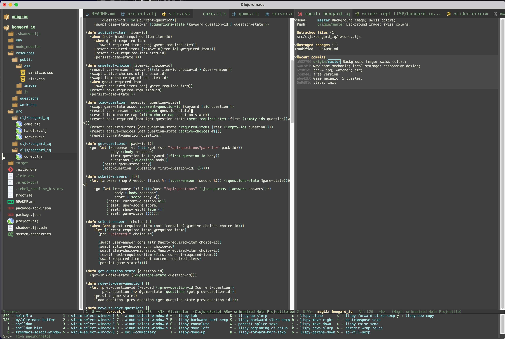

# Clojuremacs

# Philosophy

* Only do one thing (/editing Clojure code)/ and do it fast and well (/keybinding optimized for lisp editing/). Also be Evil!
* Use literate emacs config (org-mode)

# Keybindings
   
* [SPACE] => keybinding for lisp editing
* [,] => keybinding for Clojure (currently only cider-jack-in
* [TAB] => other keybinding (windows, projectile, magit, etc)
* M-x => [SPACE][SPACE]
* [s] & [S] => slurp
* [B] & [C] => barf

# What is in the box?

* [clojure-emacs/cider: The Clojure Interactive Development Environment that Rocks for Emacs](https://github.com/clojure-emacs/cider)
* [noctuid/general.el: More convenient key definitions in emacs](https://github.com/noctuid/general.el)
* [Alexander-Miller/treemacs](https://github.com/Alexander-Miller/treemacs)
* [manateelazycat/awesome-tab: Emacs package to provide out-of-the-box configuration to use tabs.](https://github.com/manateelazycat/awesome-tab)
* [Org mode for Emacs](https://orgmode.org/)
* [magit/magit: It's Magit! A Git porcelain inside Emacs.](https://github.com/magit/magit)
* [justbur/emacs-which-key: Emacs package that displays available keybindings in popup](https://github.com/justbur/emacs-which-key)
* [kyagi/shell-pop-el: shell-pop.el helps you to use shell easily on Emacs. Only one key action to work.](https://github.com/kyagi/shell-pop-el)
* [Overdr0ne/shelldon](https://github.com/Overdr0ne/shelldon)
* [gregsexton/origami.el: A folding minor mode for Emacs](https://github.com/gregsexton/origami.el)
* [Fanael/rainbow-delimiters: Emacs rainbow delimiters mode](https://github.com/Fanael/rainbow-delimiters?auto_subscribed=false)
* [deb0ch/emacs-winum: Window numbers for Emacs - Navigate windows and frames using numbers](https://github.com/deb0ch/emacs-winum)
* [Projectile | Project navigation and management library for Emacs](https://projectile.mx/)
* [EmacsWiki: Par Edit](https://www.emacswiki.org/emacs/ParEdit)
* [abo-abo/lispy: Short and sweet LISP editing](https://github.com/abo-abo/lispy)
* [Fuco1/smartparens: Minor mode for Emacs that deals with parens pairs and tries to be smart about it.](https://github.com/Fuco1/smartparens)

# Work remaining to be done

* Install and configure clj-refactor.el
* Fix evil in other buffer type (magit, *warning*, etc)

